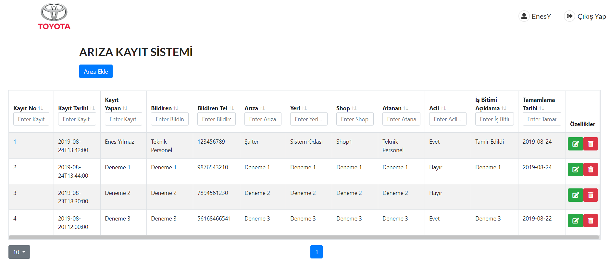

# React Arıza Takip Sistemi

React ve Spring Boot ile yaptığımız arıza takip sistemi. 
Toyota Proje yarışması için arkadaşım Emirhan ile beraber yaptık.



## Kurulum

Projeyi indirdikten sonra gerekli modülleri kurmak için

```sh
npm install
```

Projeyi çalıştırmak için

```sh
npm start
```

Web servisi çalıştırmak için herhangi bir Java derleyicisi kullanabilirsiniz.
Ayrıca web servis için PostgreSQL kullanmalısınız. Veritabanı bilgilerini application.properties adlı dosyaya girebilirsiniz.

## Kullanım

Projeyi çalıştırdıktan sonra kayıt olup üye girişi yaptıktan sonra arıza kayıt sistemi karşınıza gelir.
Arıza kayıt sisteminden arıza ekleme, düzenleme, silme işlemlerini yapabilirsiniz.

## Meta

Enes Yılmaz – [@LinkedIn](https://www.linkedin.com/in/enes-ylmz/) – enes.yilmaz15@ogr.sakarya.edu.tr
[https://github.com/EnesYilmz]

Emirhan Ülker – [@LinkedIn](https://www.linkedin.com/in/emir-%C3%BClker-21b33416a/) – emirhan.ulker@ogr.sakarya.edu.tr
[https://github.com/Emrhnlkr]
